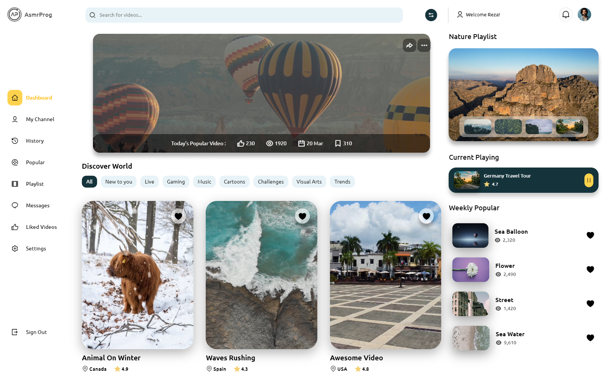

# Responsive Video Sharing Platform UI

🌟 Exploring the Ultimate Video Sharing Platform UI Design! 🎥💻
([Open Video in Youtube](https://youtu.be/dmksnIhTokg))

Welcome to AsmrProg! In this exciting video, we delve deep into the intricacies of designing a user-friendly and visually stunning UI for a video sharing platform. Whether you're a seasoned developer looking for inspiration or a newbie eager to learn, this video has something for everyone!

🔍 What's Inside:

- An in-depth walkthrough of the key components of a video sharing platform UI.
- Tips and tricks for creating a seamless user experience, from navigation to content discovery.
- Design principles and best practices to make your platform stand out in a crowded digital landscape.
- Insightful commentary on the latest trends and innovations shaping the future of UI design in the realm of web coding.

Join us on this journey as we dissect the anatomy of a top-notch video sharing platform UI and uncover the secrets to crafting an interface that captivates users and keeps them coming back for more. Whether you're a designer, developer, or simply curious about the magic behind your favorite video-sharing sites, this video is sure to inform and inspire!
Don't forget to like, share, and subscribe for more exciting content on web coding, UI/UX design, and everything in between. Let's dive in and revolutionize the way we experience online video together! 💡✨

# Screenshot
Here we have project screenshot :

